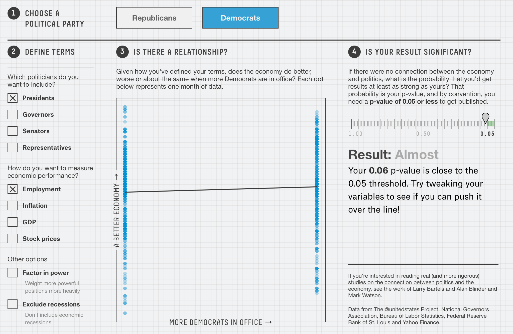

# Hack Your Way To Scientific Glory—recreation with Quarto, R, and Observable


<!-- README.md is generated from README.qmd. Please edit that file -->

I’ve long used FiveThirtyEight’s interactive “Hack Your Way To Scientific Glory” website (formerly at `https://projects.fivethirtyeight.com/p-hacking/`) to illustrate the idea of p-hacking [when I teach statistics](https://evalsp25.classes.andrewheiss.com/content/06-content.html).

However, in March 2025 ABC/Disney [shut down FiveThirtyEight](https://www.theguardian.com/us-news/2025/mar/05/abc-news-538-shut-down), so anything with a fivethirtyeight dot com URL is permanently broken.

The Internet Archive’s Wayback Machine [has a working copy here](https://web.archive.org/web/20250130080601/https://projects.fivethirtyeight.com/p-hacking/), but I wanted to make my own to ease the burden on their site, and also because I was interested in figuring out how they built their original site.

Hence this project: <https://stats.andrewheiss.com/hack-your-way/>

Here I use [Observable JS](https://observablehq.com/@observablehq/observable-javascript) and [Quarto](https://quarto.org/) to recreate their original site. It’s not 100% perfect—some of the calculated p-values are a little off—but it’s in the general ballpark, and it works!

(This could also be done with Shiny and R and/or Python. The `data_to_use()` function in [`explore-data.R`](explore-data.R) creates the same datasets that are used in the browser version.)

## Data

The original data comes from a bunch of public data sources, and Jeff Goldsmith has 6 separate CSV files (from the original FiveThirtyEight authors) of the raw data [here](https://p8105.com/dataset_fivethirtyeight.html). They’re included in [`data/fivethirtyeight_datasets`](data/fivethirtyeight_datasets) in this repository.

I use [`clean-data.R`](clean-data.R) to load and clean and join them all together, resulting in a final CSV file available at [`data/538_p_hacking.csv`](data/538_p_hacking.csv).

## Indicators

I then use [`explore-data.R`](explore-data.R) to create their political index and better economy index. This was tricky to figure out and involved a lot of reverse engineering from their massive Javascript file + tinkering with different ways of calculating variables.

- TODO: Add details about each of the indidcators and how they’re combined
- TODO: Add details about the weighting

For instance, here’s my version of presidents vs. unemployment:

``` r
library(tidyverse)

source("explore-data.R")

full_data <- read_csv("data/538_p_hacking.csv")

blah <- data_to_use(
  full_data, 
  party = "dem", 
  pol_terms = c("prez"), 
  econ_terms = c("unemp"),
  exclude_recessions = FALSE,
  weighted = FALSE
)

ggplot(blah, aes(x = pol_score, y = econ_score)) +
  geom_point(color = "#35A1D5", alpha = 0.25) +
  geom_smooth(method = "lm", se = FALSE, color = "black") +
  theme_minimal()
```


``` r

lm(econ_score ~ pol_score, data = blah) |> 
  parameters::model_parameters(verbose = FALSE, keep = "pol_score")
#> Parameter | Coefficient |   SE |        95% CI | t(808) |     p
#> ---------------------------------------------------------------
#> pol score |        0.22 | 0.12 | [-0.01, 0.44] |   1.87 | 0.062
```

And theirs—it’s the same!



## Regressions

The original interactive site didn’t run any regressions. Instead, it had a JSON-based dataset behind-the-scenes with the p-value for every possible combination of party × politicans (15 possible combinations) × economic outcome (15 possible combinations) × weighting × recessions (2×2×15×15×2 = 1,800 p-values!), and it would look up the values and points as people changed options.

Here, I use Observable Plot to plot the actual regression line live with `Plot.linearRegressionY()`, and I use [jStat](https://jstat.github.io/) to run the regression live and extract the p-value. Everything happens in the browser!

## License

idk. Now that FiveThirtyEight is dead, I don’t know about the legal status of their archived data or websites 🤷‍♂️.

[The {fivethirtyeight} package](https://github.com/rudeboybert/fivethirtyeight) offers a ton of FiveThirtyEight’s other datasets (though not this one), and it’s not published by or affiliated with FiveThirtyEight, so I’m following the same general principle here. This is all publicly accessible data already (though the really smart people at FiveThirtyEight cleaned it up and made it easy to use!).

My code in this repository is all public domain—do whatever you want with it!
